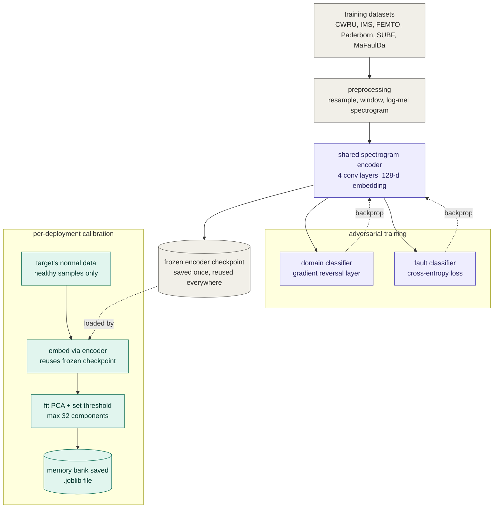
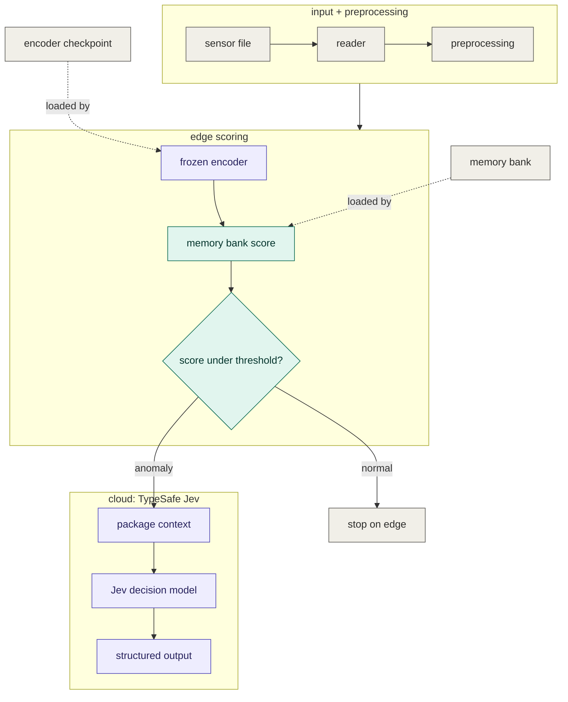

# Canary — Zero-Shot Multimodal Fault Detection

The name comes from the old mining canary: it does not need to identify the problem,
only to react early enough for someone to investigate it.
Canary is a real-time diagnostic system for detecting mechanical faults such as bearing
failures, imbalance, misalignment, and worn belts. It uses vibration and audio from
consumer-grade sensors such as a phone microphone or accelerometer, and does not require
labeled fault data from the target vehicle. It first learns a baseline from a few seconds
of healthy operation and uses that baseline to detect unusual behavior locally before
sending anything to the cloud.

This matters because the standard approach to this problem — supervised fault
classification — needs thousands of labeled examples of a machine *actively failing*,
collected from that exact machine. No consumer can supply that. Our architecture is built
around the constraint that the only data a real driver can ever realistically provide is
"here is what my car sounds/feels like right now, and it's fine."

## Contents

1. [Origin & motivation](#1-origin--motivation)
2. [Datasets](#2-datasets)
3. [Architecture](#3-architecture)
4. [Training pipeline](#4-training-pipeline)
5. [Inference pipeline](#5-inference-pipeline)
6. [Model development and experimental validation](#6-model-development-and-experimental-validation)
7. [Results](#7-results)
8. [Repository structure](#8-repository-structure)
9. [Setup and running](#9-setup-and-running)
10. [Known limitations](#10-known-limitations)
11. [Data licensing & attribution](#11-data-licensing--attribution)
12. [How AI was used](#12-how-ai-was-used)

---

## 1. Origin & motivation

The project started from conversations in two labs at **IIT Guwahati**: the Mechanical
Engineering workshop and a Chemical Engineering process lab. The teaching assistants and
lab technicians described a similar problem with rotating equipment such as motors, pumps,
and compressors. The equipment often starts making a different sound or vibration before
a failure, but it is difficult to tell whether the change needs immediate attention.
Small issues can therefore be left until the equipment fails and an unplanned repair takes
much longer than a routine inspection.

The same problem exists outside the labs. Small EVs and two-wheelers, as well as fleets
of pumps, compressors, and motors, may not have calibrated sensors or a reliability
engineer watching them continuously. Someone may notice that the machine sounds or feels
different, but still not know whether it needs attention immediately. Canary is aimed at
that gap between noticing a change and deciding whether it is worth investigating.

---

## 2. Datasets

This project is built on physical sensor data — vibration accelerometer readings and
raw audio — from public, physics-grounded fault datasets, spanning five sensing
modalities (vibration, audio, motor current, force, torque) and machine classes from
laboratory bearing rigs to a real automobile engine. No dataset here is synthetic; every
signal was recorded from a physical rotating machine or vehicle.

### 2.1 Why public datasets, and what qualifies one for inclusion

The encoder needs data from many machines, operating conditions, and fault types before
it can be expected to transfer to a new machine. Collecting that amount of data ourselves
was not realistic within the project timeframe. We therefore used established research
datasets for pretraining and evaluated them individually before including them. The
following checks were used for dataset selection:

1. **Real physical origin.** The signal must come from an actual physical sensor
   (accelerometer, microphone, current/force/torque transducer) mounted on a real
   rotating machine — never a simulated or synthetically generated waveform.
2. **Traceable provenance.** The dataset must come from an identifiable research group,
   institution, or documented public repository with a citation — not an anonymous
   re-upload with no way to verify what it actually is. This is the exact check that
   caught the "Engine Acoustic Emissions" dataset below being a relabeled bearing-rig
   simulator rather than the real engine audio it was advertised as.
3. **A usable normal/healthy baseline.** Our deployed anomaly detector calibrates on
   normal-only data (Section 3) — a dataset with only fault examples and no healthy
   baseline can't be used the way this project needs it.
4. **Sufficient sample rate for the modality.** The sensor's sampling rate has to be high
   enough to physically carry the frequency content a fault would show up in. Where this
   isn't clearly true (Engine Journal Bearings' native ~296 Hz rate, Section 10), it's
   flagged as a limitation rather than silently accepted.
5. **A license compatible with research/hackathon use**, with any stricter restriction
   (Paderborn's non-commercial license) called out explicitly rather than absorbed
   silently — see Section 11.
6. **Independent inspection before trust.** Every dataset here was actually downloaded
   and manually checked against its own documentation, not taken on faith — the
   discipline that caught the mislabeled dataset above and an incorrect sample-rate
   assumption in SUBF (Section 2.2).

Datasets that pass these filters are used for three distinct purposes, kept strictly
separate to avoid leakage:

| Role | Meaning |
|---|---|
| **Pretrain** | Used to train the domain-adversarial encoder's feature space. Fault labels from these datasets are used only during pretraining, never at evaluation time. |
| **Tune** | Used to validate cross-modal alignment and fusion components during development. |
| **Held-out evaluation** | Never touched during pretraining. The encoder is evaluated on these completely unseen datasets, calibrated only on a handful of that dataset's own *normal* samples — a genuine zero-fault-label test of generalization. |

### 2.2 Pretraining datasets (domain-adversarial backbone)

| Dataset | Modality | Sample rate | Notes |
|---|---|---|---|
| **[CWRU](https://engineering.case.edu/bearingdatacenter/download-data-file)** (Case Western Reserve University Bearing Data Center) | Vibration | up to 48 kHz | The standard benchmark in the bearing-fault literature; inner/outer race and rolling-element faults under controlled load. |
| **[IMS](https://phm-datasets.s3.amazonaws.com/NASA/4.+Bearings.zip)** (Intelligent Maintenance Systems, NSF I/UCR) | Vibration | 20 kHz | Run-to-failure recordings from real bearing test rigs, used to learn degradation trajectories rather than a single fault/no-fault snapshot. |
| **[FEMTO / PRONOSTIA](https://github.com/wkzs111/phm-ieee-2012-data-challenge-dataset)** | Vibration | 25.6 kHz | High-speed bearing degradation data (Bearing1_1, Bearing2_1) under varying speed/load, used to stress-test robustness to operating-condition shift. |
| **[Paderborn University](https://mb.uni-paderborn.de/kat/forschung/bearing-datacenter/data-sets-and-download)** | Vibration, **motor current, force, torque** | 64 kHz (vib) | The only dataset here with four synchronized modalities on the same fault event. Used to confirm the domain-adversarial approach transfers to non-vibration sensing (a from-scratch torque-domain classifier reached 98.7% in-domain accuracy). |
| **[SUBF](https://www.kaggle.com/datasets/sumairaziz/subf-v2-0-dataset-bearing-faults-sound-data)** | Audio | ~4.8 kHz (physically verified via FFT harmonic-peak analysis; the file headers claim 44.1 kHz, which does not match the recorded content) | Squeal and bearing-fault audio, used to seed the audio branch's domain-invariance training. |

### 2.3 Tuning datasets (multimodal fusion development)

| Dataset | Modality | Notes |
|---|---|---|
| **[MaFaulDa](https://www02.smt.ufrj.br/~offshore/mfs/page_01.html)** (Machinery Fault Database) | Vibration (tri-axial) + audio, synchronized | Six machine states: normal, imbalance, horizontal/vertical misalignment, inner/outer/ball bearing fault. Used to develop and later re-evaluate cross-modal fusion (Section 6). |

### 2.4 Held-out evaluation datasets (zero-shot test)

| Dataset | Modality | Files | Notes |
|---|---|---|---|
| **[AI Mechanic](https://www.kaggle.com/datasets/eoinedge/ai-mechanic-engine-condition-audio-fault-finding)** | Audio | ~39 usable recordings | Real BMW M54B25 engine audio, real induced faults (air leak, oil cap off). |
| **[Car Diagnostics Dataset](https://www.kaggle.com/datasets/malakragaie/car-diagnostics-dataset)** | Audio | 1,386 real automotive recordings | Consumer-recorded faults: worn serpentine belts, squealing brakes, and more, in real cars. Never seen during pretraining. |
| **[Engine Journal Bearings Dataset](https://data.mendeley.com/datasets/3fcrrdjjvk/5)** (Mendeley) | Vibration | 134 files (healthy + faulty), multiple RPM/temperature/humidity conditions | Vibration recordings from a real automobile engine's journal bearings — the only held-out dataset that is itself an actual vehicle engine rather than a laboratory rig. |
| **[MathWorks Rolling-Element Bearing Fault Dataset](https://github.com/mathworks/RollingElementBearingFaultDiagnosis-Data)** | Vibration | Small (3 normal files total) | Controlled inner-race/outer-race/rolling-element faults under varying load and speed; kept as a held-out sanity check despite its small size (see Section 10). |

### 2.5 Datasets considered and not used

Not every dataset acquired made it into pretraining or evaluation. Kept visible here
rather than silently dropped:

| Dataset | Status | Reason |
|---|---|---|
| **[Engine Acoustic Emissions](https://www.kaggle.com/datasets/julienjta/engine-acoustic-emissions)** (Kaggle) | Rejected after inspection | Its `.mat` file keys (`normal`, `inner`, `roller`, `outer`) exactly mirror the CWRU bearing-fault taxonomy — it's a relabeled bearing test-rig simulation, not real engine audio as advertised. Excluded to keep every "held-out, real-world" claim in this project honest. Kept as evidence in `sample_data/engine_acoustic_emissions/` rather than deleted. |
| **[UORED-VAFCLS](https://data.mendeley.com/datasets/y2px5tg92h/5)** (University of Ottawa, multimodal) | Acquisition incomplete | Identified as a relevant paired audio-vibration rolling-element-fault dataset; the download did not complete during this project's build window, so no reader/label code was ever written against it. Not used anywhere in this project's results. |
| **[Multi-Sensor Metal Milling Anomaly](https://www.kaggle.com/datasets/manufuturetoday/multi-sensor-for-metal-milling-anomaly)** (Kaggle) | Acquisition incomplete | A vibration+audio metal-milling anomaly dataset; only a partial download (3 files from a 14GB dataset) was attempted and it did not complete. Not used anywhere in this project's results. |
| **[Vehicle Interior Sound](https://zenodo.org/records/5606504)** (Zenodo) | Considered, not used | Normal-condition audio diversity only — no fault labels — so it doesn't fit this project's anomaly-detection evaluation, which needs both normal and faulty examples per dataset. |

### 2.6 Sample data in this repo

The full raw data (~26GB) is not committed (Section 9), but a real, representative
**~431MB sample of every dataset above, plus the real-world validation recordings** —
actual WAV/CSV/.mat/.npz files, never
synthetic — is committed directly under [`sample_data/`](sample_data/), along with a
**full-coverage Parquet manifest** (13,900+ rows, every file this project uses, across
every dataset, with its label and role) under [`sample_data/manifest/`](sample_data/manifest/).
See [`sample_data/README.md`](sample_data/README.md) for exactly what's in each folder and
how it was selected.

### 2.7 Real-world validation: a self-collected washing machine dryer

Section 7's results are all on public research datasets. Because the deployed detector
only ever needs *normal*-condition data to calibrate — never fault labels (Section 3) —
a small set of manually-collected recordings is enough to validate the pipeline
end-to-end on genuinely self-collected data, even though it would never be enough to
*train* anything (why manual collection wasn't attempted for pretraining — Section 2.1).

Two washing machine dryers were recorded with a phone (accelerometer + microphone,
via the free "Sensor Logger" Android app) — one with a known, constant dryer fault,
and a second, healthy machine to provide a real normal-operating-condition calibration
source. Full collection method, preprocessing, and every check run are in
[`sample_data/real_world_validation/LOG.md`](sample_data/real_world_validation/LOG.md);
the recordings and the full run log are committed alongside it.

Testing happened in two rounds — right after the faulty machine was recorded, and
again once the healthy machine was recorded — and both rounds' results are kept below.

**Round 1 — faulty machine only.**

*Check 1: scored against the pre-built deployment memory banks* (Section 7's Car
Diagnostics/Engine Journal Bearings calibration — the exact banks `predict.py` loads).
A cross-machine, cross-sensor zero-shot test, since this washing machine contributed
zero data to that calibration.

| Modality | Running (faulty, on) | Silent (off, ambient) |
|---|---|---|
| Vibration | mean 0.00672 — 100% flagged anomaly | mean 0.00329 — 100% flagged anomaly |
| Audio (raw, original test) | mean 1.71e-5 — 94% flagged anomaly | mean 1.70e-5 — 92% flagged anomaly |
| Audio (denoised against its own silent clip) | mean 4.59e-5 — 100% flagged anomaly | mean 1.70e-5 — 92% flagged anomaly |

Raw audio barely separated running from silent (scores within 0.5% of each other);
spectral-gate denoising (against the machine's own silent recording as a noise
profile) widened that to running scoring 2.7x silent's score.

*Check 2: self-consistency* — fit a PCA detector on the faulty machine's own silent
windows only, score its running windows against that.

| Modality | Running vs. silent-calibration |
|---|---|
| Vibration | mean 0.205 — 100% flagged anomaly |
| Audio | mean 0.00087 — 100% flagged anomaly |

**Round 2 — faulty + healthy machine.**

*Check 3: train-on-healthy, test-on-faulty* — the project's actual deployed
architecture, run end-to-end on self-collected data for the first time. The PCA
memory bank was calibrated on the healthy machine's own running windows, then the
faulty machine's running windows were scored against it.

| Modality | Faulty running (the target test) | Healthy silent (reference) | Faulty silent (reference) |
|---|---|---|---|
| **Vibration** | **mean 0.00583 — 100% flagged anomaly** | mean 0.000225 | mean 0.00109 |
| Audio | mean 0.000396 — 100% flagged anomaly | mean 0.000465 | mean 0.000341 |

Vibration ranks the faulty machine's running state as clearly the highest-scoring of
the three real recordings (5x above the faulty machine's own silent state, 26x above
the healthy machine's silent state) — and this is the first time this exact
calibrate-on-healthy, flag-the-anomaly loop has been run on real, self-collected data
end to end. Audio's three scores were close together without a clear ranking.

### 2.8 Data documentation: row count, collection window, and observed vs. inferred vs. synthetic

Per-dataset row count, from the full-coverage manifest (Section 2.6):

| Dataset | Rows | Label origin |
|---|---|---|
| SUBF | 6,480 | Observed |
| FEMTO | 3,714 | **Inferred** (run-to-failure heuristic) |
| Car Diagnostics | 1,386 | Observed |
| IMS | 984 | **Inferred** (run-to-failure heuristic) |
| MaFaulDa | 542 | Observed |
| Paderborn | 480 | Observed |
| CWRU | 161 | Observed |
| Engine Journal Bearings | 134 | Observed |
| AI Mechanic | 39 | Observed |
| MathWorks | 20 | Observed |
| Engine Acoustic Emissions | 1 | N/A — rejected, not used |
| **Total** | **13,941** | 9,243 observed / 4,698 inferred |

**Observed vs. inferred vs. synthetic, defined precisely for this project:**

- **Observed (9,243 rows, 66%):** the healthy/faulty label comes directly from the
  dataset's own documented structure — a folder name, a filename code, or a label file
  the original source published. Nothing about the label itself was estimated.
- **Inferred (4,698 rows, 34%, all from IMS and FEMTO):** both are natural
  run-to-failure recordings with no documented discrete fault-onset time. This
  project's readers apply a threshold heuristic — the first 30% of a run's
  chronologically-sorted files count as "healthy," the last 30% as "degraded," the
  middle 40% excluded as ambiguous — which is a monotonic proxy, not a verified
  ground-truth boundary. [`check_run_to_failure_label_sensitivity.py`](scripts/eval/check_run_to_failure_label_sensitivity.py)
  exists specifically to show how much this threshold choice changes the result.
- **Synthetic:** no signal data in this project is synthetic — no waveform was
  generated. The one artificial construction is in
  [`evaluate_synthetic_multimodal.py`](scripts/eval/evaluate_synthetic_multimodal.py),
  which pairs a real Car Diagnostics audio file with a real Engine Journal Bearings
  vibration file by list index only, since no dataset here has genuinely simultaneous
  audio+vibration from a consumer vehicle. Both halves of every pair are real,
  unaltered recordings — only the *pairing* between them is artificial, and this is
  documented as a caveat directly in that script and in Section 7's discussion of its
  result (0.626 fused vs. 0.729 vibration-only).

**Collection window and cadence:**

- **Public datasets** (Sections 2.2-2.4): each was collected and published by its
  original research group; original collection dates are documented in their own
  papers/repositories (linked in Section 11), not independently re-verified here. No
  new signal was recorded for these — they were downloaded as-is.
- **Self-collected real-world data** (Section 2.7): recorded on a single day,
  2026-09-27, between 07:49 and 08:04 IST (Asia/Calcutta) — a ~16-minute window across
  all four clips (faulty-running, faulty-silent, healthy-running, healthy-silent), all
  with the same phone and app session. Exact epoch timestamps are in each recording's
  own `Metadata.csv`, committed under `sample_data/real_world_validation/`. This is a
  single collection pass, not a repeated-cadence series — a real limitation, named
  directly in Section 10.

---

## 3. Architecture

The system is a two-stage Edge + Cloud pipeline:

- **Stage 1 (Edge):** A lightweight CNN spectrogram encoder, trained with domain-adversarial
  regularization, converts any windowed signal into a 128-dimensional embedding. A
  per-modality **PCA-reconstruction memory bank**, calibrated on nothing but the target
  vehicle's own healthy recordings, scores that embedding for anomaly. Both steps run in
  milliseconds on a laptop CPU with no backpropagation and no network call.
- **Stage 2 (Cloud):** Only triggered when Stage 1 flags an anomaly. The anomaly score,
  modality, and any free-text mechanic notes are routed to **TypeSafe AI's Jev**, a
  structured ("System One") decision model that returns a typed fault classification,
  severity score, and recommended action — not conversational text.

The split is mainly about deployment. Continuous deep inference on a consumer device is
expensive, while a cloud API adds network dependency and cost. The edge stage filters out
normal operation, so the cloud model is only called when the local detector sees an
anomaly.

### Why a custom encoder instead of a pretrained audio backbone alone

We evaluated a fine-tuned VGGish (AudioSet-pretrained CNN) backbone as an alternative to
training our own encoder from scratch (Section 6). It is a capable model — its last
convolutional block, fine-tuned with the same domain-adversarial objective, reaches
1.000 AUC in-domain on SUBF and 0.815 AUC on MaFaulDa — but our custom vibration-domain
encoder, combined with per-vehicle PCA calibration, outperformed it on the two largest
held-out datasets (0.953 and 0.933 AUC vs. 0.824 on the strongest VGGish-based
configuration; see Section 7). We therefore use the custom encoder for vibration and
audio, and treat the fine-tuned VGGish backbone as a validated but currently unused
alternative rather than discarding the experiment.

### Related work

Zero-shot bearing-fault detection has been approached differently elsewhere — notably a
[Qatar University study (arXiv:2212.06154)](https://arxiv.org/abs/2212.06154), which
trains a 1D operational GAN to synthesize a target machine's faulty signal from its own
normal signal plus a source machine's normal-to-fault transition, then trains a
Self-ONN classifier on the synthesized data. Our approach instead never synthesizes fault
data: it scores real embeddings against a reconstruction-error threshold calibrated only
on the target machine's real normal data — a different tradeoff (no synthetic-fault-quality
risk to manage, at the cost of not learning an explicit fault-type classifier at the edge).

---

## 4. Training pipeline



Balanced per-domain batch sampling, fault-only warm-start epochs before the adversarial
term switches on, and a per-step lambda ramp (Ganin & Lempitsky, 2016) are used to keep
the six-domain adversarial training stable — an earlier two-domain-only version of this
training loop collapsed to always predicting the majority domain without these.

### How this was built inside a 48-hour window

Nine-plus datasets, six training domains, and several evaluation runs sound like a lot
for a 48-hour build, but most of the work did not run one step at a time. Downloads ran in
parallel with preprocessing, since the downloads were mainly I/O-bound. Preprocessing and
evaluation used up to 10 CPU cores at a time; [`cpu_guard.py`](src/cpu_guard.py) keeps that
within a defined limit. This reduced the amount of wall-clock time spent waiting on
sequential processing.

---

## 5. Inference pipeline



Real, end-to-end run against a held-out faulty vibration file (Engine Journal Bearings
dataset), Stage 2 shown in offline demo mode since no cloud API key was configured for
this run:

```text
> python scripts/inference/predict.py --file "data/raw/engine_journal_bearings/.../1st at -10 2022Jun04-2239-0005.csv" --modality vibration --notes "Loud rattling from engine block when accelerating past 40mph."

Running Inference on VIBRATION file: 1st at -10 2022Jun04-2239-0005.csv
Extracting Features...
Extracted Embedding Vector of shape (128,)

========================================
STAGE 1 (EDGE): Anomaly Score = 0.000632  (threshold = 0.000000)
Status: ANOMALY DETECTED! Triggering Stage 2 (Cloud).
========================================

STAGE 2 (CLOUD): Routing to TypeSafe AI Jev-Omni...
[Demo Mode] No API Key found (checked TYPESAFE_API_KEY and OPENROUTER_API_KEY). Mocking Jev response...
    -> Fault Type: Bearing_Failure
    -> Severity: High
    -> Recommended Action: Replace pulley bearing immediately.
```

*(The printed threshold rounds to `0.000000` at 6 decimal places — the real calibrated
value is ≈2.1×10⁻¹³, well below the anomalous file's score. With a `TYPESAFE_API_KEY` or
`OPENROUTER_API_KEY` set, Stage 2 calls the real Jev model instead of the offline mock.)*

---

## 6. Model development and experimental validation

Four modeling approaches were built and evaluated before arriving at the final design:

1. **MFCC + Gradient Boosting** — a cheap, interpretable baseline (AUC ≈ 0.76 in-domain).
   Useful as a sanity floor, but its fixed hand-crafted features don't scale to the
   multi-modal, multi-dataset transfer this project requires.
2. **Fine-tuned VGGish backbone** — validated in-domain (SUBF 1.000 AUC, MaFaulDa 0.815
   AUC) and, combined with a One-Class SVM, reached 0.824 AUC on the held-out AI Mechanic
   audio dataset — the best result obtained on that specific dataset. Kept as a documented
   alternative; not the deployed path because the custom vibration encoder generalized
   better on the two larger held-out datasets.
3. **Cross-modal contrastive fusion** (audio + vibration) — achieved strong internal
   retrieval accuracy (2.4% top-1 out of thousands of candidates, far above the 0.18%
   chance rate) but requires synchronized dual-sensor capture and constant bandwidth
   between two sensors, which conflicts with the ultra-lightweight, single-sensor edge
   deployment target. Score-level ensembling of independently-scored modalities was
   evaluated as a lighter-weight alternative (see below).
4. **Domain-Adversarial Neural Network (DANN), vibration + audio** — the final selection.
   Trained jointly across CWRU, IMS, FEMTO, Paderborn, and SUBF, the vibration-trained
   encoder transfers to acoustic held-out datasets more reliably than the audio-trained
   encoder does, because vibration captures structural resonance directly rather than
   through acoustic-environment noise (wind, traffic, combustion).

**Score-level ensembling.** Rather than concatenating raw feature vectors from every
source into one high-dimensional anomaly detector — which earlier fusion attempts in
this project did, and which struggles badly with the 13-30 calibration-normal samples
realistically available per dataset — each source (vibration, audio, VGGish,
fine-tuned VGGish, MFCC) is scored independently with its own PCA reconstruction-error
detector, then combined by a reliability-weighted average of z-normalized scores (weights
derived from each source's own held-out generalization gap, shrunk 50% toward equal
weighting as a safeguard against noisy small-sample estimates). On the datasets and
sample sizes evaluated, the strongest single source matched or exceeded the ensembled
score, so the deployed system scores each modality independently rather than fusing them
— a decision made from evidence, not assumption.

**Robustness checks.** Two null-baseline checks were run against every reported number:
(1) a randomly-initialized, untrained encoder of identical architecture, to isolate how
much of any result comes from learned domain-adversarial features versus generic CNN
structure alone; (2) published unsupervised anomaly-detection benchmarks from the
acoustic/vibration literature (Section 7). This surfaced a real, reported limitation —
the from-scratch vibration encoder alone underperforms a random encoder on MaFaulDa
(0.615 vs. 0.863 AUC) — which is exactly why the deployed system never scores on the raw
encoder output directly. Every deployed detector re-calibrates a PCA memory bank on the
target dataset's own normal data before scoring anything, which is what the strong
numbers in Section 7 actually depend on.

---

## 7. Results

### Held-out zero-shot anomaly detection (final architecture)

| Dataset | Modality | Method | AUC |
|---|---|---|---|
| **Engine Journal Bearings** (real automobile engine) | Vibration | PCA reconstruction-error | **0.953** (up to 1.000 with max-pooling/PatchCore-style aggregation) |
| **Car Diagnostics** (1,386 real car recordings) | Audio, vibration-trained encoder | PCA reconstruction-error | **0.933** |
| **AI Mechanic** | Audio | Fine-tuned VGGish backbone + One-Class SVM | **0.811** |
| **MaFaulDa** | Vibration | PCA reconstruction-error (calibrated on 5 real normal files) | 0.863 |
| **MathWorks Rolling-Element Bearing** | Vibration | PCA reconstruction-error (calibrated on 1 normal file, tested on 2) | 0.891 |

### Context from published literature

Directly comparable numbers don't exist — no published benchmark uses these exact
datasets — but for context, a widely-cited unsupervised acoustic/vibration anomaly
detection comparison reports the following AUCs for standard unsupervised methods
([Deep Autoencoding GMM-based Unsupervised Anomaly Detection in Acoustic Signals,
arXiv:2009.12042](https://arxiv.org/pdf/2009.12042)):

| Method | Reported AUC |
|---|---|
| One-Class SVM | 0.65 |
| PCA + One-Class SVM | 0.63 |
| Denoising Autoencoder | 0.66 |
| Gaussian Mixture Model | 0.77 |
| Denoising Autoencoder + GMM | 0.79 |

Our vibration-based results (0.953, 0.933) sit above this reported range; the
audio-only result (0.824) sits within it. Fully supervised bearing-fault classifiers in
the literature reach ~0.99 accuracy, but require thousands of labeled faulty examples
from the exact target machine — data no consumer vehicle owner can provide, which is the
constraint this project is built around.

---

## 8. Repository structure

```
.
├── requirements.txt
├── sample_data/                       # Committed real-data sample (~431MB) — see Section 2.6
│   ├── README.md
│   ├── manifest/                      # Full-coverage Parquet manifest + SCHEMA.md
│   ├── real_world_validation/         # Self-collected washing machine recordings + LOG.md — see Section 2.7
│   └── <dataset>/...                  # Representative real files, one folder per dataset
├── src/                              # Core library code (no side effects on import)
│   ├── cpu_guard.py                  # CPU/RAM safety guard used by every long-running script
│   ├── data/
│   │   ├── download.py               # Dataset download helpers
│   │   ├── download_manifest.py      # Declarative manifest of dataset sources
│   │   ├── preprocess.py             # Universal signal -> log-mel spectrogram pipeline
│   │   └── readers.py                # Per-dataset file readers + label functions
│   └── models/
│       ├── baseline_mfcc.py          # MFCC + Gradient Boosting baseline
│       ├── encoder.py                # SpectrogramEncoder, DomainAdversarialEncoder, load_encoder
│       ├── fusion.py                 # Cross-modal contrastive fusion layer
│       ├── grl.py                    # Gradient Reversal Layer
│       ├── memory_bank.py            # PCAReconstructionMemoryBank (fit/score/save/load)
│       └── vggish_finetune.py        # VGGishLastBlockDANN + VGGish input-module loader
├── scripts/
│   ├── train/
│   │   ├── train_domain_adversarial_v2.py  # Main DANN training across all 6 domains
│   │   ├── train_vggish_finetune.py        # Fine-tunes VGGish's last conv block with a DANN head
│   │   └── finish_fusion_layer.py          # Trains the cross-modal contrastive fusion layer
│   ├── eval/
│   │   ├── evaluate_anomaly_only.py            # Headline cross-dataset anomaly-detection sweep
│   │   ├── evaluate_mafaulda.py                # Held-out MaFaulDa evaluation
│   │   ├── evaluate_mathworks_vibration.py     # Held-out MathWorks bearing evaluation
│   │   ├── evaluate_ai_mechanic_optimized.py   # AI Mechanic audio: filtering/pooling variants
│   │   ├── evaluate_memory_bank.py             # Pooling-method comparison for the memory bank
│   │   ├── evaluate_score_ensemble.py          # Score-level multi-source ensemble evaluation
│   │   ├── evaluate_stage3_calibrated.py       # Calibrated fused-feature anomaly evaluation
│   │   ├── evaluate_stage3_ablation.py         # Ablation study on fusion components
│   │   ├── evaluate_synthetic_multimodal.py    # Arbitrarily-paired audio+vibration fusion check
│   │   ├── evaluate_new_dataset.py             # ESC-50 environmental-sound sanity comparison
│   │   ├── evaluate_real_world_washing_machine.py     # Real-world validation (Section 2.7)
│   │   ├── check_random_encoder_baseline.py           # Null baseline: untrained vs. trained encoder
│   │   ├── check_encoder_beats_random_indomain.py     # Same check, restricted to in-domain data
│   │   ├── check_run_to_failure_label_sensitivity.py  # Label-threshold sensitivity for IMS/FEMTO
│   │   └── verify_vggish_finetune_checkpoint.py       # Re-verifies the fine-tuned VGGish checkpoint
│   ├── inference/
│   │   └── predict.py                # End-to-end Edge + Cloud demo script
│   └── utils/
│       ├── build_memory_bank.py              # Fits and saves the real PCA memory banks
│       ├── build_evaluator_data_sample.py    # Builds sample_data/ from a full data/raw/
│       ├── download_milling_subset.py        # Downloads a representative dataset subset
│       └── export_dataset_manifest.py        # Writes the Parquet manifest in sample_data/manifest/
└── data/                              # Not committed — see Setup below
    ├── raw/                           # Downloaded datasets (full ~26GB)
    └── processed/                     # Checkpoints, memory banks, feature caches
```

---

## 9. Setup and running

### Prerequisites

Python 3.10+.

```bash
pip install -r requirements.txt
pip install typesafe-sdk   # only needed for the live Stage 2 cloud call
```

### 0. Look at real data without downloading anything

[`sample_data/`](sample_data/) ships in this repository — open it directly to see real
sensor files from every dataset this project uses, and
[`sample_data/manifest/`](sample_data/manifest/) for the full-coverage Parquet structural
manifest, before downloading anything.

### 1. Get the full data

Raw datasets (~26 GB total across all sources) are not committed to this repository.
Fetch a representative subset with:

```bash
python scripts/utils/download_milling_subset.py
```

Some datasets (MaFaulDa, MathWorks) are distributed under terms that require a manual
download from their original source; see `src/data/download_manifest.py` for the exact
source URLs and expected `data/raw/` layout.

### 2. Train the encoders (optional — checkpoints can also be provided directly)

```bash
python scripts/train/train_domain_adversarial_v2.py
```

### 3. Build the memory banks

Required before running inference — this fits the PCA anomaly detectors on real
normal-only calibration data:

```bash
python scripts/utils/build_memory_bank.py
```

### 4. Run an evaluation suite

```bash
python scripts/eval/evaluate_anomaly_only.py
python scripts/eval/evaluate_mafaulda.py
```

### 5. Run the inference demo

```bash
python scripts/inference/predict.py --file "data/raw/engine_journal_bearings/.../<file>.csv" --modality vibration --notes "Loud rattling from engine block."
```

Set `TYPESAFE_API_KEY` or `OPENROUTER_API_KEY` in the environment to route Stage 2 to
the real Jev decision model; without a key, Stage 2 prints a clearly labeled offline mock
response and Stage 1's real anomaly score is unaffected.

---

## 10. Known limitations

- **MaFaulDa and MathWorks calibration sets are very small** (5 and 1 normal files
  respectively), so their AUCs (0.675 and 0.891) are less statistically reliable than the
  Car Diagnostics and Engine Journal Bearings results, which calibrate on dozens of files.
- **Audio-only detection is the weakest link.** Even the best audio-only configuration
  (fine-tuned VGGish + One-Class SVM, 0.824 AUC on AI Mechanic) trails the vibration
  results, which is why vibration is the primary modality and audio is treated as a
  secondary/supporting signal.
- **The from-scratch vibration encoder alone is not reliably better than a random
  encoder** on every dataset (Section 6) — all deployed detectors depend on per-domain
  PCA memory-bank calibration, not on the raw encoder embedding space by itself.
- **Stage 2 requires a TypeSafe or OpenRouter API key** for live cloud classification;
  without one, `predict.py` runs Stage 1 for real but reports a clearly labeled mock
  result for Stage 2.

---

## 11. Data licensing & attribution

| Dataset | License | Source | Notes |
|---|---|---|---|
| CWRU | Free for research use | [engineering.case.edu/bearingdatacenter](https://engineering.case.edu/bearingdatacenter/download-data-file) | |
| IMS | Public domain | [NASA Prognostics Data Repository](https://phm-datasets.s3.amazonaws.com/NASA/4.+Bearings.zip) | |
| FEMTO / PRONOSTIA | Open research use | [IEEE PHM 2012 Prognostic Challenge](https://github.com/wkzs111/phm-ieee-2012-data-challenge-dataset) | |
| **Paderborn (KAt)** | **CC BY-NC 4.0 — non-commercial only** | Lessmeier et al., [Paderborn University Bearing Data Center](https://mb.uni-paderborn.de/kat/forschung/bearing-datacenter/data-sets-and-download) | **See flag below** |
| SUBF | Kaggle research use | [`sumairaziz/subf-v2-0-dataset-bearing-faults-sound-data`](https://www.kaggle.com/datasets/sumairaziz/subf-v2-0-dataset-bearing-faults-sound-data) | |
| MaFaulDa | Public | [UFRJ Signals, Multimedia and Telecommunications Lab](https://www02.smt.ufrj.br/~offshore/mfs/page_01.html) | |
| AI Mechanic | Kaggle research use | [`eoinedge/ai-mechanic-engine-condition-audio-fault-finding`](https://www.kaggle.com/datasets/eoinedge/ai-mechanic-engine-condition-audio-fault-finding) | Real BMW M54B25 engine |
| Car Diagnostics | Kaggle research use | [`malakragaie/car-diagnostics-dataset`](https://www.kaggle.com/datasets/malakragaie/car-diagnostics-dataset) | |
| Engine Journal Bearings | CC BY 4.0 | Riaz et al., Mendeley Data, DOI [10.17632/3fcrrdjjvk.5](https://data.mendeley.com/datasets/3fcrrdjjvk/5) | |
| MathWorks Rolling-Element Bearing | Redistributed with permission | [github.com/mathworks/RollingElementBearingFaultDiagnosis-Data](https://github.com/mathworks/RollingElementBearingFaultDiagnosis-Data) | Originally collected by Eric Bechhoefer; MathWorks has permission to redistribute for their Predictive Maintenance Toolbox example. Contact Bechhoefer directly for other commercial uses, per the source repository's own README. |
| Engine Acoustic Emissions | N/A | [`julienjta/engine-acoustic-emissions`](https://www.kaggle.com/datasets/julienjta/engine-acoustic-emissions) (Kaggle) | Rejected after inspection (Section 2.5); not used in any result. |
| UORED-VAFCLS | Public (Mendeley) | Sehri & Dumond, [DOI 10.17632/y2px5tg92h](https://data.mendeley.com/datasets/y2px5tg92h/5) | Acquisition incomplete (Section 2.5); not used in any result. |
| Multi-Sensor Metal Milling Anomaly | Kaggle research use | [`manufuturetoday/multi-sensor-for-metal-milling-anomaly`](https://www.kaggle.com/datasets/manufuturetoday/multi-sensor-for-metal-milling-anomaly) | Acquisition incomplete (Section 2.5); not used in any result. |
| Vehicle Interior Sound | Open (Zenodo) | [zenodo.org/records/5606504](https://zenodo.org/records/5606504) | Considered, not used (Section 2.5) — no fault labels. |

**License conflict, flagged explicitly:** Paderborn/KAt's data is licensed **CC BY-NC 4.0
(non-commercial only)**, and it is one of the four core pretraining domains for the
primary vibration encoder. Research/hackathon use fits within that license, but any future
commercial deployment of a model whose vibration encoder was pretrained on Paderborn data
would need to either retrain the encoder without Paderborn or obtain separate permission
from Paderborn University.

---

## 12. How AI was used

AI tools were used during the project mainly to speed up research, dataset discovery,
experimentation, debugging, and documentation. The team still implemented, tested, and
checked the resulting work rather than treating generated output as the final answer.

### Research and problem exploration

During the early stages, AI tools were used to explore existing work on zero-shot and
unsupervised fault detection, multimodal condition monitoring, domain adaptation, anomaly
detection, acoustic and vibration analysis, and predictive maintenance.

This helped the team:

* identify relevant research directions and existing approaches;
* compare supervised, unsupervised, self-supervised, and domain-adversarial approaches;
* identify potentially relevant public datasets and research repositories;
* understand the sensing modalities used in existing fault-detection systems;
* investigate appropriate evaluation methodologies and anomaly-detection baselines;
* explore alternative model architectures before committing to the final design.

Generated suggestions were treated as starting points. Dataset descriptions, licensing
terms, sampling rates, and experimental claims were checked against the original dataset
documentation and source repositories before being used.

### Dataset discovery and preparation

AI tools were also used during dataset acquisition and analysis. Candidate datasets were
filtered by modality, machine type, fault coverage, availability of healthy data,
provenance, and licensing.

The team downloaded and inspected the candidate datasets directly. AI tools helped with:

* identifying relevant datasets across vibration, audio, current, force, and torque modalities;
* designing a common dataset manifest and reader interface;
* understanding different directory structures and label conventions;
* detecting inconsistencies between advertised and observed metadata;
* designing preprocessing and normalization strategies;
* comparing candidate datasets for pretraining, tuning, and held-out evaluation;
* investigating sampling-rate and signal-quality issues.

An important example was the SUBF dataset, where the advertised sample rate was inconsistent with the frequency content actually present in the recordings. signal analysis with AI tools helped identify the discrepancy, after which the observation was independently verified using FFT-based harmonic analysis and the documented shaft rotation frequency.

AI was used to speed up the investigation, but the final dataset decisions were based on
the downloaded data and the original documentation.

### Model and experiment development

AI tools were useful for quickly exploring several alternatives, including:

* MFCC + Gradient Boosting;
* fine-tuned VGGish;
* cross-modal contrastive fusion;
* domain-adversarial representation learning;
* PCA reconstruction-error anomaly detection;
* score-level ensembling.

This made it practical to implement and test several alternatives within the project
timeframe instead of choosing the architecture only from the theory.

### Experiment design and validation

AI was also used during experiment review to look for possible leakage, overfitting,
misleading evaluations, and unsupported assumptions. The goal was not just to find good
numbers, but also to find cases where the approach was failing or the evaluation could be
misleading.

This contributed to additional validation experiments, including:

* random/untrained encoder baselines;
* IMS/FEMTO label-threshold sensitivity analysis;
* comparison against alternative model architectures;
* held-out cross-dataset evaluation;
* small-sample calibration checks;
* examination of negative experimental results;
* independent inspection of dataset provenance and metadata.

Negative results were kept when they contradicted the original hypothesis. For example, the from-scratch vibration encoder did not outperform a random encoder on every dataset, which led to the decision to rely on per-domain PCA memory-bank calibration rather than treating the raw learned embedding as a sufficient anomaly detector.
